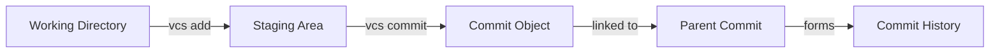

<div align="center">

# 🔰 Git-Lite

### A Lightweight Version Control System Built with Core Data Structures

[](https://isocpp.org/)
[](https://github.com/RavenX-Iman/Git-Lite)

*Demonstrating practical applications of Data Structures in real-world software development*

[Features](#-features) • [Quick Start](#-quick-start) • [Usage](#-usage) • [Architecture](#-architecture) • [Team](#-authors)

</div>

---

## 📖 Overview

**Git-Lite** is a simplified version control system that implements essential Git-like functionality from scratch. Built as a semester project for the Data Structures course at COMSATS University Islamabad, this system demonstrates how fundamental data structures power real-world version control operations.

Unlike typical academic projects, Git-Lite goes beyond theory, it's a **functional tool** that can track changes, maintain history, and manage file versions using optimized algorithms and carefully chosen data structures.

### 🎯 Project Philosophy

> *"The best way to understand version control isn't to use Git—it's to build one."*

This project bridges the gap between theoretical DSA concepts and practical software engineering by implementing:
- **Hash-based content addressing** for efficient storage
- **Linked list commit chains** for history tracking  
- **Tree structures** for branch management
- **Dynamic programming** for file comparison

---

## ✨ Features

### Currently Implemented

<table>
<tr>
<td width="50%">

#### 🚀 Repository Initialization
```bash
vcs init MyProject
```
- Creates `.gitlite` directory structure
- Initializes HEAD and main branch
- Sets up object and commit storage
- Detects and handles re-initialization

</td>
<td width="50%">

#### 📦 File Staging
```bash
vcs add filename.txt
```
- Hash-based content storage
- Efficient duplicate detection
- Automatic object management
- Index tracking for staged files

</td>
</tr>
<tr>
<td>

#### 💾 Commit Creation
```bash
vcs commit -m "Your message"
```
- Immutable snapshots with metadata
- Linked commit history (parent-child)
- Automatic timestamping
- Branch pointer updates

</td>
<td>

#### 📜 History Viewing
```bash
vcs log
```
- View complete commit history
- Shows commit hash, message, author
- Displays parent relationships
- Lists all files in each commit

</td>
</tr>
<tr>
<td colspan="2">

#### 📊 Repository Status
```bash
vcs status
```
- Shows staged files ready for commit
- Lists untracked files in working directory
- Clean, organized output
- Helpful usage hints

</td>
</tr>
</table>

---
### 🔄 Coming Soon™
- `vcs rm` - Unstage/remove files
- `vcs checkout` - Restore files from commits
- `vcs branch` - Create/manage branches

---

## 🏗️ Architecture

### Project Structure
```
Git-Lite/
├── README.md                 # Project documentation
├── LICENSE                   # MIT License
├── .gitignore               # Git ignore rules
│
├── src/                     # Source code
│   ├── main.cpp            # Entry point & command parser
│   │
│   ├── commands/           # Command implementations
│   │   ├── init.cpp/.h    # Repository initialization
│   │   ├── add.cpp/.h     # File staging
│   │   ├── commit.cpp/.h  # Commit creation
│   │   ├── log.cpp/.h     # History viewing
│   │   └── status.cpp/.h  # Status checking
│   │
│   └── utils/              # Utility functions
│       ├── helpers.cpp/.h # Cross-platform helpers
│       └── (future utils) # Hash, file I/O, etc.
│
├── build/                   # Compiled binaries
│   └── vcs.exe             # Executable (gitignored)
│
├── docs/                    # Documentation
│   └── (future docs)       # Architecture, API, etc.
│
└── examples/                # Usage examples
    └── (future examples)   # Tutorials, demos
```

### Repository Structure
```
MyProject/
└── .gitlite/
    ├── HEAD                      # Current branch pointer
    ├── index                     # Staging area
    ├── objects/                  # Content storage (hash-indexed)
    │   ├── 1234567890           # File snapshots
    │   └── 9876543210
    ├── commits/                  # Commit metadata
    │   ├── abc123.txt           # Commit objects
    │   └── def456.txt
    └── branches/                 # Branch references
        └── main                  # Points to latest commit
```
### Data Structures Implementation
```
┌─────────────────────────────────────────────────┐
│               Git-Lite System                   │
├─────────────────────────────────────────────────┤
│                                                 │
│  Hash Tables  →  Content-addressable storage    │
│  Linked Lists →  Commit chain & history         │
│  Trees        →  Directory structure & branches │
│  File System  →  Persistent data storage        │
│                                                 │
└─────────────────────────────────────────────────┘
```

### How It Works


> 📚 **Deep Dive:** For comprehensive architecture documentation including detailed data flow, implementation specifics, and algorithm explanations, see [docs/ARCHITECTURE.md](docs/ARCHITECTURE.md)

---

---

## 🚀 Quick Start

### Prerequisites
```bash
# Windows
- MinGW GCC/G++ compiler (8.1.0 or higher)
- C++17 support
- Visual Studio Code (recommended)

# Linux/Mac  
- GCC/G++ (7.0 or higher)
- C++17 support
- Any text editor
```

### Installation
```bash
# Clone the repository
git clone https://github.com/RavenX-Iman/Git-Lite.git
cd Git-Lite

# Create build directory and compile
mkdir build

# Windows
g++ vcsf.cpp -o build/vcs.exe

# Linux/Mac
g++ vcsf.cpp -o build/vcs
chmod +x build/vcs
```

### First Steps
```bash
# 1. Initialize a new repository
build/vcs init TechVault
cd TechVault

# 2. Create and add files
echo "print('Hello World!')" > app.py
../build/vcs add app.py

# 3. Check status
../build/vcs status

# 4. Commit your changes
../build/vcs commit -m "Initial commit"

# 5. View history
../build/vcs log
```

---

## 💻 Usage

### Complete Workflow Example
```bash
# Initialize repository
build/vcs init MyProject
cd MyProject

# Create files
echo "# MyProject" > README.md
echo "print('Hello')" > main.py
echo "def helper(): pass" > utils.py

# Check what's untracked
../build/vcs status

# Stage files
../build/vcs add README.md
../build/vcs add main.py

# Check status again
../build/vcs status

# Commit
../build/vcs commit -m "Initial commit: Added README and main"

# Add more files
../build/vcs add utils.py
../build/vcs commit -m "Added utility functions"

# View history
../build/vcs log
```

### Command Reference

| Command | Description | Example |
|---------|-------------|---------|
| `vcs init <name>` | Create new repository | `vcs init MyRepo` |
| `vcs add <file>` | Stage a file | `vcs add main.cpp` |
| `vcs commit -m "msg"` | Commit staged files | `vcs commit -m "Fixed bug"` |
| `vcs log` | View commit history | `vcs log` |
| `vcs status` | Check repository status | `vcs status` |
---

## 🧮 Algorithm Complexity

| Operation | Time Complexity | Space Complexity | Notes |
|-----------|----------------|------------------|-------|
| `init` | O(1) | O(1) | Directory creation only |
| `add` | O(n) | O(n) | n = file size (hashing + I/O) |
| `commit` | O(m) | O(m) | m = staged files count |
| `log` | O(c) | O(1) | c = commit count |
| `status` | O(f) | O(f) | f = files in directory |
| Hash Lookup | O(1) avg | O(k) | k = object size |
| History Traversal* | O(c) | O(1) | c = commit count |

*Future implementation

### Storage Efficiency

- **Deduplication**: Identical files stored once (content-addressed)
- **Incremental**: Only changed files consume additional space
- **Metadata**: Minimal overhead per commit (~500 bytes)

---

## 🛠️ Technical Details

### Hash-Based Storage
```cpp
// Content → Hash → Storage
size_t hashValue = hash<string>{}(fileContent);
string objectId = to_string(hashValue);
string objectPath = ".gitlite/objects/" + objectId;
```

### Commit Chain Structure
```cpp
struct Commit {
    string hash;           // Unique identifier
    string parent;         // Previous commit (linked list)
    string message;        // User description
    string author;         // Commit author
    string timestamp;      // Creation time
    vector<string> files;  // File snapshots
};
```
### Cross-Platform Compatibility"
*(Tested on Windows, designed for cross-platform)*"
```cpp
// Windows & Linux support
#ifdef _WIN32
    #include <windows.h>
    // Windows-specific code
#else
    #include <dirent.h>
    // POSIX-specific code
#endif
```

### File Format
```
commit: 1234567890
parent: null
message: Initial commit
author: Huma Ijaz
date: 2025-11-15 10:30:00
files:
  9876543210 file1.txt
  5555555555 file2.cpp
```

---

## 🎓 Academic Context

**Course:** Data Structures  
**Institution:** COMSATS University Islamabad, Sahiwal Campus  
**Department:** Software Engineering  
**Session:** Fall 2025  
**Supervisor:** Shaheen Kausar

### Learning Objectives Met

✅ Practical application of hash tables and linked lists  
✅ File I/O and serialization techniques  
✅ Algorithm design and complexity analysis  
✅ Software architecture and modular design  
✅ Version control system internals  


## 👥 Authors

<table>
<tr>
<td align="center" width="33%">
<br />
<sub><b>Eman Tahir</b></sub><br />
<a href="https://github.com/RavenX-Iman">SP24-BSE-020</a><br />
<sub>Commit System & Documentation</sub>
</td>
<td align="center" width="33%">
<br />
<sub><b>Huma Ijaz</b></sub><br /><a href="https://github.com/Huma-Ijaz">SP24-BSE-034</a><br />
<sub>File Staging & Hash Implementation</sub>
</td>
<td align="center" width="33%">
<br />
<sub><b>Areeba Asif</b></sub><br />
<a href="https://github.com/areebactech">SP24-BSE-042</a><br />
<sub>Repository Initialization & Architecture</sub>
</td>
</tr>
</table>

---

## 🗺️ Project Roadmap
```
Phase 1: Core Functions ━━━━━━━━━━━━━━━━━━━━━━━━ 30% ✅
├── Repository initialization        ✅
├── File staging system              ✅  
├── Commit creation                  ✅
├── History viewing (log)            ✅
└── Status checking                  ✅

Phase 2: Advanced Features ━━━━━━━━━━━━━━━━━━━━  0%
├── Checkout & restoration           📋
├── Branch management                📋
├── File comparison (diff)           📋
├── Merge functionality              📋
└── Conflict resolution              📋

Phase 3: Optimization ━━━━━━━━━━━━━━━━━━━━━━━━━  0%
├── Performance tuning               📋
├── Memory optimization              📋
├── Compression support              📋
└── Large file handling              📋
```

**Legend:** ✅ Complete | 🔄 In Progress | 📋 Planned

---

## 🧪 Testing

### Test Suite Results
```bash
✅ Repository initialization
✅ File staging with duplicate detection
✅ Commit chain with parent linking
✅ Log display with full history
✅ Status showing staged/untracked files
```

### Manual Testing Example
```bash
# All tests passing ✅
build/vcs init TestRepo     # Creates .gitlite structure
cd TestRepo
echo "test" > file.txt
../build/vcs add file.txt   # Adds to staging
../build/vcs status         # Shows staged file
../build/vcs commit -m "T"  # Creates commit
../build/vcs log            # Displays history
```

---

```

### Expected Behavior

- ✅ Reinitializing existing repo shows appropriate message
- ✅ Adding non-existent files displays error
- ✅ Empty staging area prevents commits
- ✅ Commits properly chain together
- ✅ Identical content uses same object hash

---

## 🔧 Development

### Building from Source
```bash
# Debug build
g++ -g -Wall vcsf.cpp -o vcs_debug

# Optimized build
g++ -O3 vcsf.cpp -o vcs

# With all warnings
g++ -Wall -Wextra -pedantic vcsf.cpp -o vcs
```

### Code Structure
```cpp
vcsf.cpp
├── Helper Functions
│   └── makeDir()              // Cross-platform directory creation
├── Core Commands  
│   ├── vcs_init()            // Repository initialization
│   ├── vcs_add()             // File staging
│   └── vcs_commit()          // Snapshot creation
└── Main Entry
    └── Command parser & dispatcher
```

---

## 🤝 Contributing

We welcome contributions from students, developers, and anyone interested in version control!

### Quick Contributing Guide

**For Students & Learners:**
- 🐛 **Report Bugs** - Found an issue? Open a GitHub issue
- 💡 **Suggest Features** - Ideas for improvement? Let us know
- 📚 **Improve Docs** - Help make our documentation clearer
- ✨ **Add Examples** - Share interesting use cases

**For Developers:**
```bash
# Quick start
git clone https://github.com/RavenX-Iman/Git-Lite.git
cd Git-Lite
g++ vcsf.cpp -o build/vcs
```

**Contribution Steps:**
1. Fork the repository
2. Create a feature branch (`git checkout -b feature/amazing-feature`)
3. Make your changes and test thoroughly
4. Commit with clear messages (`git commit -m 'Add: feature description'`)
5. Push and open a Pull Request

> 📚 **Full Guidelines:** See [docs/CONTRIBUTING.md](docs/CONTRIBUTING.md) for detailed code style, testing procedures, commit message format, and complete contribution workflow.


---

## 📚 References & Resources

### Core Learning Materials
1. **Pro Git (2nd Edition)** - Scott Chacon & Ben Straub  
   📖 [Free Online Book](https://git-scm.com/book/en/v2)

2. **Git Internals Documentation**  
   🔧 [Official Plumbing Guide](https://git-scm.com/book/en/v2/Git-Internals-Plumbing-and-Porcelain)

3. **Data Structures and Algorithms in C++** - Adam Drozdek  
   📘 Standard DSA textbook

### Inspirations
- [Git Source Code](https://github.com/git/git) - The real deal
- [Gitlet](http://gitlet.maryrosecook.com/) - JavaScript implementation
- [ugit](https://www.leshenko.net/p/ugit/) - Python implementation

---

## 📝 License

This project is created for **educational purposes** as part of the Data Structures course curriculum at COMSATS University Islamabad.

**Academic Use:** Free to use, modify, and learn from  
**Attribution:** Please credit the original authors when using this code

---

## 🐛 Known Issues & Limitations

- ⚠️ **Single-user only**: No authentication or multi-user support
- ⚠️ **No compression**: Files stored as-is (not compressed)
- ⚠️ **Basic hashing**: Uses `std::hash` (not cryptographic)
- ⚠️ **No merge**: Branch merging not implemented yet
- ⚠️ **Windows paths**: May have issues with special characters

### Future Improvements
- Add SHA-256 for content hashing
- Implement compression (zlib)
- Add network protocol for remote repos
- Create GUI interface
- Support larger binary files

---

## 💬 FAQ

**Q: Can I use this for real projects?**  
A: Git-Lite is educational. For production, use Git. But it's great for learning!

**Q: Why not just use Git?**  
A: Building your own teaches you how version control *actually* works.

**Q: What's the difference from Git?**  
A: Simplified algorithms, no network features, basic data structures.

**Q: Can I contribute?**  
A: Absolutely! See the [Contributing](#-contributing) section.

---

## 🎯 Success Metrics

- ✅ Successfully implements 3 core VCS operations
- ✅ Demonstrates understanding of hash tables and linked lists
- ✅ Includes proper documentation and testing
- ✅ Shows complexity analysis and optimization
- 🎯 **Target Grade: A**

---

## 📧 Contact

**Project Link:** [https://github.com/RavenX-Iman/Git-Lite](https://github.com/RavenX-Iman/Git-Lite)


---

<div align="center">

### ⭐ Star this repo if you found it helpful!

 COMSATS University Islamabad Sahiwal Campus  
 Department of Software Engineering

**Data Structures - Fall 2025**

[⬆ Back to Top](#-git-lite)

</div>
