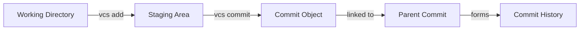

<div align="center">

# 🔰 Git-Lite

### A Lightweight Version Control System Built with Core Data Structures

[](https://isocpp.org/)
[](https://github.com/RavenX-Iman/Git-Lite)

*Demonstrating practical applications of Data Structures in real-world software development*

[Features](#-features) • [Quick Start](#-quick-start) • [Usage](#-usage) • [Architecture](#-architecture) • [Team](#-authors)

</div>

---

## 📖 Overview

**Git-Lite** is a simplified version control system that implements essential Git-like functionality from scratch. Built as a semester project for the Data Structures course at COMSATS University Islamabad, this system demonstrates how fundamental data structures power real-world version control operations.

Unlike typical academic projects, Git-Lite goes beyond theory, it's a **functional tool** that can track changes, maintain history, and manage file versions using optimized algorithms and carefully chosen data structures.

### 🎯 Project Philosophy

> *"The best way to understand version control isn't to use Git—it's to build one."*

This project bridges the gap between theoretical DSA concepts and practical software engineering by implementing:
- **Hash-based content addressing** for efficient storage
- **Linked list commit chains** for history tracking  
- **Tree structures** for branch management
- **Dynamic programming** for file comparison

---

## ✨ Features

### ✅ Currently Implemented

<table>
<tr>
<td width="50%">

#### 🚀 Repository Initialization
```bash
vcs init MyProject
```
- Creates `.gitlite` directory structure
- Initializes HEAD and main branch
- Sets up object and commit storage
- Detects and handles re-initialization

</td>
<td width="50%">

#### 📦 File Staging
```bash
vcs add filename.txt
```
- Hash-based content storage
- Efficient duplicate detection
- Automatic object management
- Index tracking for staged files

</td>
</tr>
<tr>
<td>

#### 💾 Commit Creation
```bash
vcs commit -m "Your message"
```
- Immutable snapshots with metadata
- Linked commit history (parent-child)
- Automatic timestamping
- Branch pointer updates

</td>
<td>

#### 🔄 Coming Soon™
- `vcs log` - View commit history
- `vcs status` - Check file states
- `vcs rm` - Unstage/remove files

</td>
</tr>
</table>

---

## 🏗️ Architecture

### Data Structures Implementation
```
┌─────────────────────────────────────────────────┐
│               Git-Lite System                    │
├─────────────────────────────────────────────────┤
│                                                  │
│  Hash Tables  →  Content-addressable storage    │
│  Linked Lists →  Commit chain & history         │
│  Trees        →  Directory structure & branches │
│  File System  →  Persistent data storage        │
│                                                  │
└─────────────────────────────────────────────────┘
```

### Repository Structure
```
MyProject/
└── .gitlite/
    ├── HEAD                      # Current branch pointer
    ├── index                     # Staging area
    ├── objects/                  # Content storage (hash-indexed)
    │   ├── 1234567890           # File snapshots
    │   └── 9876543210
    ├── commits/                  # Commit metadata
    │   ├── abc123.txt           # Commit objects
    │   └── def456.txt
    └── branches/                 # Branch references
        └── main                  # Points to latest commit
```

### How It Works


---

## 🚀 Quick Start

### Prerequisites
```bash
# Windows
- MinGW GCC/G++ compiler
- Visual Studio Code (recommended)

# Linux/Mac  
- GCC/G++ (usually pre-installed)
- Any text editor
```

### Installation
```bash
# Clone the repository
git clone https://github.com/RavenX-Iman/Git-Lite.git
cd Git-Lite

# Compile the program
# Windows
g++ vcsf.cpp -o vcs.exe

# Linux/Mac
g++ vcsf.cpp -o vcs
chmod +x vcs
```

### First Steps
```bash
# 1. Initialize a new repository
./vcs init MyFirstRepo
# Output: Initialized empty Git-Lite repository in MyFirstRepo/.gitlite

# 2. Create a file and add it
echo "Hello, Git-Lite!" > test.txt
./vcs add test.txt
# Output: Added test.txt to staging area.

# 3. Commit your changes
./vcs commit -m "Initial commit"
# Output: Committed as 1234567890: Initial commit
```

---

## 💻 Usage

### Basic Workflow
```bash
# Initialize repository
vcs init ProjectName

# Stage files
vcs add file1.txt
vcs add file2.cpp
vcs add *.h                    # Multiple files

# Create commit
vcs commit -m "Descriptive message here"

# Reinitialize (safe operation)
vcs init ProjectName           # Detects existing repo
```

### Advanced Examples
```bash
# Track a C++ project
vcs init MyCppProject
vcs add main.cpp
vcs add utils.h utils.cpp
vcs commit -m "Add main program and utilities"

# Make changes and commit again
# Edit main.cpp...
vcs add main.cpp
vcs commit -m "Fix bug in main function"

# Each commit creates a new node in the history chain
```

---

## 🧮 Algorithm Complexity

| Operation | Time Complexity | Space Complexity | Notes |
|-----------|----------------|------------------|-------|
| `init` | O(1) | O(1) | Directory creation only |
| `add` | O(n) | O(n) | n = file size (hashing + I/O) |
| `commit` | O(m) | O(m) | m = staged files count |
| Hash Lookup | O(1) avg | O(k) | k = object size |
| History Traversal* | O(c) | O(1) | c = commit count |

*Future implementation

### Storage Efficiency

- **Deduplication**: Identical files stored once (content-addressed)
- **Incremental**: Only changed files consume additional space
- **Metadata**: Minimal overhead per commit (~500 bytes)

---

## 🛠️ Technical Details

### Hash-Based Storage
```cpp
// Content → Hash → Storage
size_t hashValue = hash<string>{}(fileContent);
string objectId = to_string(hashValue);
string objectPath = ".gitlite/objects/" + objectId;
```

### Commit Chain Structure
```cpp
struct Commit {
    string hash;           // Unique identifier
    string parent;         // Previous commit (linked list)
    string message;        // User description
    string author;         // Commit author
    string timestamp;      // Creation time
    vector<string> files;  // File snapshots
};
```

### File Format
```
commit: 1234567890
parent: null
message: Initial commit
author: Huma Ijaz
date: 2025-11-15 10:30:00
files:
  9876543210 file1.txt
  5555555555 file2.cpp
```

---

## 🎓 Academic Context

**Course:** Data Structures  
**Institution:** COMSATS University Islamabad, Sahiwal Campus  
**Department:** Software Engineering  
**Session:** Fall 2025  
**Supervisor:** Shaheen Kausar

### Learning Objectives Met

✅ Practical application of hash tables and linked lists  
✅ File I/O and serialization techniques  
✅ Algorithm design and complexity analysis  
✅ Software architecture and modular design  
✅ Version control system internals  


## 👥 Authors

<table>
<tr>
<td align="center" width="33%">
<br />
<sub><b>Eman Tahir</b></sub><br />
<a href="https://github.com/RavenX-Iman">SP24-BSE-020</a><br />
<sub>Commit System & Documentation</sub>
</td>
<td align="center" width="33%">
<br />
<sub><b>Huma Ijaz</b></sub><br /><a href="https://github.com/Huma-Ijaz">SP24-BSE-034</a><br />
<sub>File Staging & Hash Implementation</sub>
</td>
<td align="center" width="33%">
<br />
<sub><b>Areeba Asif</b></sub><br />
<a href="https://github.com/areebactech">SP24-BSE-042</a><br />
<sub>Repository Initialization & Architecture</sub>
</td>
</tr>
</table>

---

## 🗺️ Project Roadmap
```
Phase 1: Core Functions ━━━━━━━━━━━━━━━━━━━━━━━━ 30% ✅
├── Repository initialization        ✅
├── File staging system              ✅  
├── Commit creation                  ✅
├── History viewing (log)            🔄
└── Status checking                  📋

Phase 2: Advanced Features ━━━━━━━━━━━━━━━━━━━━  0%
├── Checkout & restoration           📋
├── Branch management                📋
├── File comparison (diff)           📋
├── Merge functionality              📋
└── Conflict resolution              📋

Phase 3: Optimization ━━━━━━━━━━━━━━━━━━━━━━━━━  0%
├── Performance tuning               📋
├── Memory optimization              📋
├── Compression support              📋
└── Large file handling              📋
```

**Legend:** ✅ Complete | 🔄 In Progress | 📋 Planned

---

## 🧪 Testing

### Manual Testing Suite
```bash
# Test Case 1: Fresh initialization
vcs init TestRepo
cd TestRepo

# Test Case 2: Adding multiple files
echo "First" > file1.txt
echo "Second" > file2.txt
vcs add file1.txt
vcs add file2.txt

# Test Case 3: Commit chain
vcs commit -m "First commit"
echo "Modified" > file1.txt
vcs add file1.txt
vcs commit -m "Second commit"

# Test Case 4: Duplicate content
echo "First" > file3.txt  # Same as file1
vcs add file3.txt          # Should reuse hash
```

### Expected Behavior

- ✅ Reinitializing existing repo shows appropriate message
- ✅ Adding non-existent files displays error
- ✅ Empty staging area prevents commits
- ✅ Commits properly chain together
- ✅ Identical content uses same object hash

---

## 🔧 Development

### Building from Source
```bash
# Debug build
g++ -g -Wall vcsf.cpp -o vcs_debug

# Optimized build
g++ -O3 vcsf.cpp -o vcs

# With all warnings
g++ -Wall -Wextra -pedantic vcsf.cpp -o vcs
```

### Code Structure
```cpp
vcsf.cpp
├── Helper Functions
│   └── makeDir()              // Cross-platform directory creation
├── Core Commands  
│   ├── vcs_init()            // Repository initialization
│   ├── vcs_add()             // File staging
│   └── vcs_commit()          // Snapshot creation
└── Main Entry
    └── Command parser & dispatcher
```

---

## 🤝 Contributing

We welcome contributions! Here's how you can help:

### For Students & Learners
1. 🐛 **Report Bugs**: Found an issue? Open a GitHub issue
2. 💡 **Suggest Features**: Ideas for improvement? Let us know
3. 📚 **Improve Docs**: Help make our documentation clearer
4. ✨ **Add Examples**: Share interesting use cases

### For Developers
1. Fork the repository
2. Create a feature branch (`git checkout -b feature/AmazingFeature`)
3. Commit your changes (`git commit -m 'Add some AmazingFeature'`)
4. Push to the branch (`git push origin feature/AmazingFeature`)
5. Open a Pull Request

---

## 📚 References & Resources

### Core Learning Materials
1. **Pro Git (2nd Edition)** - Scott Chacon & Ben Straub  
   📖 [Free Online Book](https://git-scm.com/book/en/v2)

2. **Git Internals Documentation**  
   🔧 [Official Plumbing Guide](https://git-scm.com/book/en/v2/Git-Internals-Plumbing-and-Porcelain)

3. **Data Structures and Algorithms in C++** - Adam Drozdek  
   📘 Standard DSA textbook

### Inspirations
- [Git Source Code](https://github.com/git/git) - The real deal
- [Gitlet](http://gitlet.maryrosecook.com/) - JavaScript implementation
- [ugit](https://www.leshenko.net/p/ugit/) - Python implementation

---

## 📝 License

This project is created for **educational purposes** as part of the Data Structures course curriculum at COMSATS University Islamabad.

**Academic Use:** Free to use, modify, and learn from  
**Attribution:** Please credit the original authors when using this code

---

## 🐛 Known Issues & Limitations

- ⚠️ **Single-user only**: No authentication or multi-user support
- ⚠️ **No compression**: Files stored as-is (not compressed)
- ⚠️ **Basic hashing**: Uses `std::hash` (not cryptographic)
- ⚠️ **No merge**: Branch merging not implemented yet
- ⚠️ **Windows paths**: May have issues with special characters

### Future Improvements
- Add SHA-256 for content hashing
- Implement compression (zlib)
- Add network protocol for remote repos
- Create GUI interface
- Support larger binary files

---

## 💬 FAQ

**Q: Can I use this for real projects?**  
A: Git-Lite is educational. For production, use Git. But it's great for learning!

**Q: Why not just use Git?**  
A: Building your own teaches you how version control *actually* works.

**Q: What's the difference from Git?**  
A: Simplified algorithms, no network features, basic data structures.

**Q: Can I contribute?**  
A: Absolutely! See the [Contributing](#-contributing) section.

---

## 🎯 Success Metrics

- ✅ Successfully implements 3 core VCS operations
- ✅ Demonstrates understanding of hash tables and linked lists
- ✅ Includes proper documentation and testing
- ✅ Shows complexity analysis and optimization
- 🎯 **Target Grade: A**

---

## 📧 Contact

**Project Link:** [https://github.com/RavenX-Iman/Git-Lite](https://github.com/RavenX-Iman/Git-Lite)


---

<div align="center">

### ⭐ Star this repo if you found it helpful!

 COMSATS University Islamabad Sahiwal Campus  
 Department of Software Engineering

**Data Structures - Fall 2025**

[⬆ Back to Top](#-git-lite)

</div>
